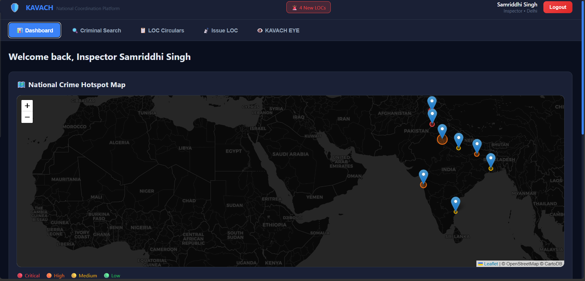
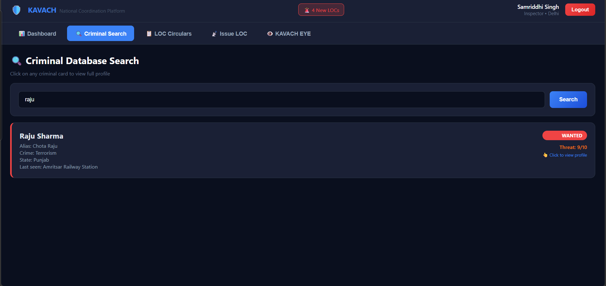
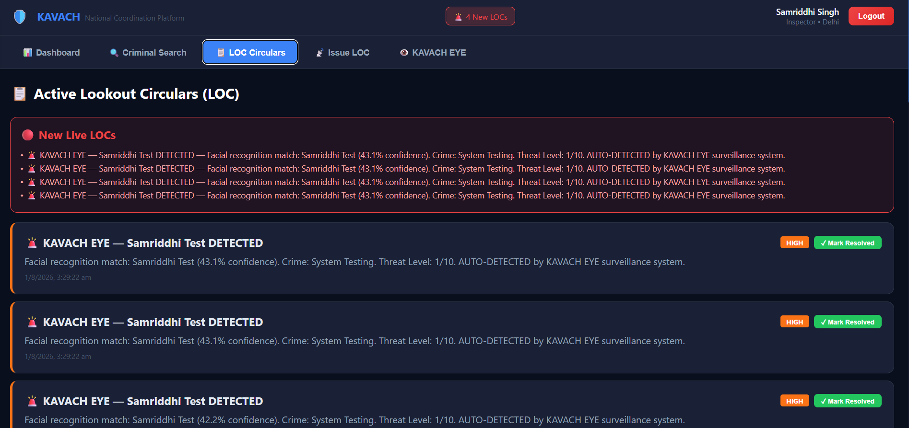

# 🛡️ KAVACH — National Law Enforcement Coordination Platform

KAVACH is a full-stack real-time platform designed to solve a critical gap in Indian law enforcement: the lack of a unified system for inter-state police coordination, criminal intelligence sharing, and real-time alert broadcasting.

Built as a solo project by a 2nd-year B.Tech CS (AI) student, inspired by real gaps identified in India's CCTNS, NATGRID, and MAC systems.

## 🎯 Problem It Solves

India currently lacks a single real-time platform where:
- State police can instantly broadcast wanted-criminal alerts to all other states
- Officers can search a unified national criminal database
- AI can provide instant threat intelligence on suspects
- Facial recognition can auto-detect wanted individuals via camera feed

KAVACH addresses each of these gaps in a working, deployable system.

## ✨ Features

- **🔐 Secure Officer Authentication** — JWT-based login with role-based access
- **🔍 Pan-India Criminal Search** — Search across states instantly by name, FIR, crime type
- **👤 Full Criminal Intelligence Profiles** — Photo, warrant status, previous crimes, known associates
- **📋 Lookout Circulars (LOC)** — Real-time alert broadcast system, modeled on actual Indian police terminology
- **✅ LOC Resolution Tracking** — Mark alerts resolved with action-taken audit trail
- **🗺️ National Crime Hotspot Map** — Interactive live map of active cases across India
- **🤖 AI Threat Assessment** — LLM-powered intelligence reports for each criminal profile
- **👁️ KAVACH EYE** — Real-time facial recognition surveillance for automated wanted-person detection
- **🔔 Real-Time Push Notifications** — Officers alerted instantly when new LOCs are issued
- **📡 Live Sync Across Devices** — Powered by Supabase Realtime; alerts appear on every connected officer's screen within seconds

## 🛠️ Tech Stack

**Frontend:** React, Leaflet.js (maps), Supabase JS Client
**Backend:** Node.js, Express.js, JWT Authentication
**Database:** Supabase (PostgreSQL) with real-time subscriptions
**AI:** Groq (Llama 3.3 70B) for threat intelligence generation
**Facial Recognition:** Browser-based real-time detection

## 📸 Screenshots

### Dashboard with Live Crime Map


### Criminal Database Search


### Full Criminal Intelligence Profile


### Lookout Circular (LOC) Alerts


### KAVACH EYE — Facial Recognition Surveillance

## 🚀 Getting Started

### Prerequisites
- Node.js v18+
- A free Supabase account
- A free Groq API key

### Installation

```bash
git clone https://github.com/Sam-A14/Kavach.git
cd Kavach

# Backend setup
cd backend
npm install
# Create .env file with SUPABASE_URL, SUPABASE_KEY, JWT_SECRET, GROQ_API_KEY
npm run dev

# Frontend setup (new terminal)
cd frontend
npm install
# Create .env file with REACT_APP_SUPABASE_URL, REACT_APP_SUPABASE_KEY, REACT_APP_API_URL
npm start
```

## 🗺️ Roadmap

- [ ] React Native mobile app for field officers
- [ ] CCTNS/NATGRID API integration
- [ ] Encrypted inter-agency chat
- [ ] Multi-language support (Hindi, regional languages)
- [ ] Offline-first architecture for low-connectivity areas

## 👩‍💻 About This Project

Built solo to explore how modern real-time web technology and AI can address real institutional gaps in Indian law enforcement coordination. This is an active work-in-progress — new features are being added continuously.

## 📄 License

This project is for educational and portfolio purposes.

---

**Built by Samriddhi Srivastava** — B.Tech CS (AI), GL Bajaj Institute of Technology and Management